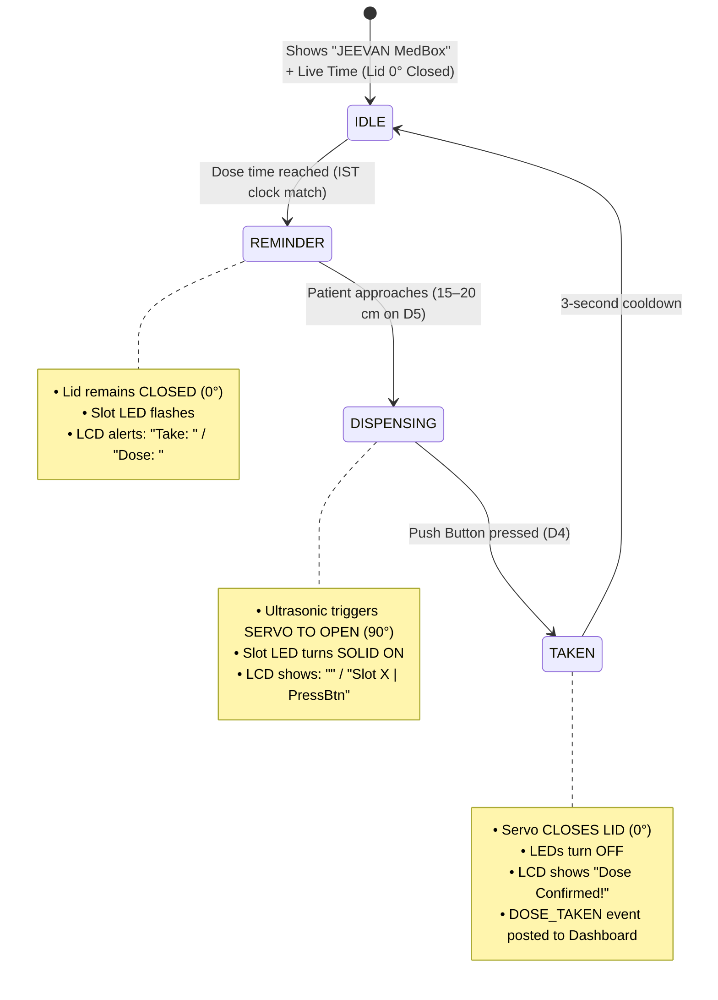

# JEEVAN Smart Medicine Box Firmware (ESP32)

Complete production firmware for the **JEEVAN Smart Medicine Box** featuring ultrasonic patient-proximity detection (15–20 cm), 1× shared SG90 servo lid actuation, 4× compartment visual LEDs, push button intake confirmation, 16x2 I2C LCD status reporting, and bidirectional synchronization with the JEEVAN Dashboard.

---

## 📌 Pin Mapping Table

| Component | ESP32 GPIO | Description / Wiring |
| :--- | :--- | :--- |
| **I2C SDA** | `GPIO 21` | 16x2 I2C LCD SDA line |
| **I2C SCL** | `GPIO 22` | 16x2 I2C LCD SCL line (Address `0x27`) |
| **HC-SR04 Trig** | `GPIO 5` | Ultrasonic trigger pulse (`D5`) |
| **HC-SR04 Echo** | `GPIO 18` | Ultrasonic echo input (`D18` or `D5` in 1-pin mode) |
| **Confirm Button**| `GPIO 4` | Push button / confirm sensor (`INPUT_PULLUP`) |
| **Servo Lid** | `GPIO 13` | 1× Shared SG90 Servo lid motor (0° closed, 90° open) |
| **LED 0** | `GPIO 27` | LED indicator for Compartment 0 (`D27`) |
| **LED 1** | `GPIO 26` | LED indicator for Compartment 1 (`D26`) |
| **LED 2** | `GPIO 25` | LED indicator for Compartment 2 (`D25`) |
| **LED 3** | `GPIO 33` | LED indicator for Compartment 3 (`D33`) |
| **Status LED** | `GPIO 2` | On-board / network status indicator |
| **Buzzer** | `GPIO 32` | Piezo buzzer (disabled in firmware until installed) |

---

## 🛠️ Required Arduino Libraries

Install these from the Arduino IDE Library Manager (**Tools → Manage Libraries...**):
1. **ArduinoJson** by Benoît Blanchon (v6.x or v7.x)
2. **ESP32Servo** by Kevin Harrington & John K. Bennett
3. **LiquidCrystal_I2C** by Frank de Brabander

---

## 🔄 Dispensing Sequence & State Machine



1. **`IDLE`**: Displays `JEEVAN MedBox` and live synchronized time `Time: HH:MM:SS`. Lid is closed (`0°`).
2. **`REMINDER`**: Dose time reached. Displays medicine name & dosage; slot LED flashes. **Lid stays CLOSED**.
3. **`DISPENSING`**: When HC-SR04 measures **`15–20 cm`**, servo **opens the lid to `90°`** and LED glows solid.
4. **`TAKEN`**: Patient takes pill and presses the **Push Button (D4)**. Servo **closes lid back to `0°`**, LED turns OFF, and intake confirmation is sent to the dashboard.
5. **Slot Assignment**: When medicine is assigned to a slot from the dashboard, LCD displays `Slot X Assigned` and the medicine name for 3.5 seconds; **lid does not open**.

---

## 🌐 API Contract Reference

### ESP32 Web Server (Port 80)
- **`GET /api/schedule`**: Returns current schedule entries in RAM (compartment indices `0`, `1`, `2`, `3`).
- **`POST /api/schedule`**: Pushes an updated schedule from the dashboard into ESP32 RAM.
- **`POST /api/compartment/assign`**: Displays assigned medicine and slot on LCD for 3.5 seconds (lid remains closed).

### Dashboard Server (Port 5050)
- **`POST /api/hardware/heartbeat`**: ESP32 reports status every 5 seconds. Dashboard responds with `{"remoteOpen": bool, "assignedSlot": {"compartment": int, "label": str, "time": str}}`.
- **`POST /api/hardware/medbox-event`**: ESP32 notifies dashboard of intake events (`box` is 1-based: `1`, `2`, `3`).
- **`POST /api/hardware/remote-open`**: Caregiver triggers remote open lid command.

---

## 🚀 Quick Start Guide

1. Open [`firmware/medicine_box/medicine_box.ino`](medicine_box.ino) in Arduino IDE.
2. Update `WIFI_SSID`, `WIFI_PASS`, and `DASHBOARD_HOST` at the top of the file to match your local network.
3. Select board: **ESP32 Dev Module**.
4. Click **Upload**.
5. Once booted, observe the IP displayed on the LCD and enter it into `dashboard-v2/.env`:
   ```env
   ESP32_BASE_URL=http://<YOUR_ESP32_IP>
   ```
6. Start the dashboard system using `start_system.bat` or `npm run dev` in `dashboard-v2`.
