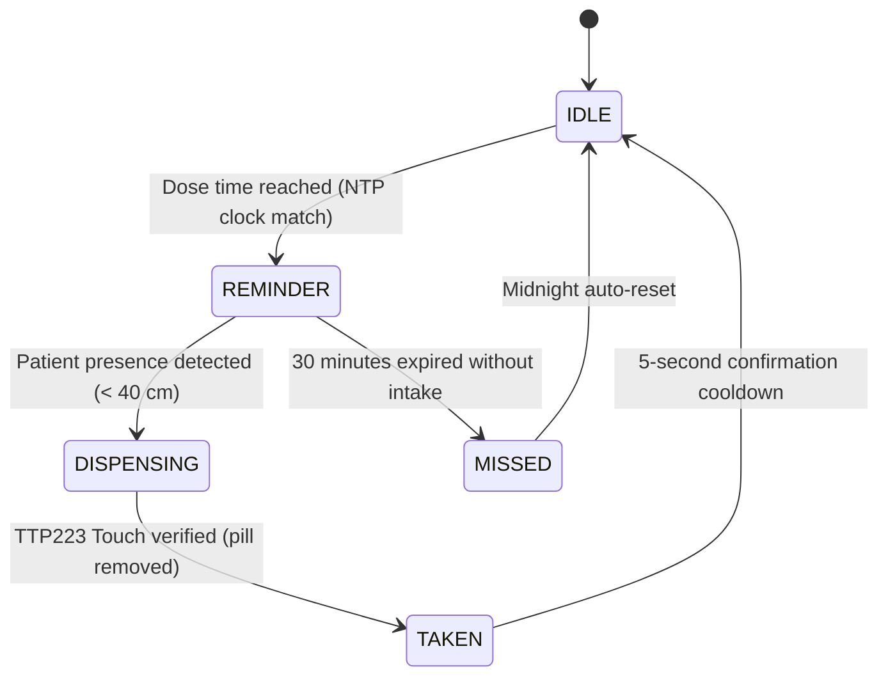

# JEEVAN Smart Medicine Box Firmware (ESP32)

Complete production firmware for the **JEEVAN Smart Medicine Box** featuring ultrasonic patient-presence detection, 3-compartment servo actuation, capacitive touch intake verification, LCD status reporting, and bidirectional synchronization with the JEEVAN Dashboard.

---

## 📌 Pin Mapping Table

| Component | ESP32 GPIO | Description / Wiring |
| :--- | :--- | :--- |
| **I2C SDA** | `GPIO 21` | 16x2 I2C LCD SDA line |
| **I2C SCL** | `GPIO 22` | 16x2 I2C LCD SCL line (Address `0x27`) |
| **HC-SR04 Trig** | `GPIO 5` | Ultrasonic trigger pulse (OUTPUT) |
| **HC-SR04 Echo** | `GPIO 18` | Ultrasonic echo input (INPUT, use 1kΩ/2kΩ divider if needed) |
| **TTP223 Touch** | `GPIO 4` | Capacitive touch sensor signal (INPUT) |
| **Buzzer** | `GPIO 32` | Active piezo buzzer for reminder beeps |
| **Status LED** | `GPIO 2` | On-board / general status indicator |
| **Servo 0** | `GPIO 13` | SG90 Servo for Compartment 0 (0° closed, 90° open) |
| **Servo 1** | `GPIO 12` | SG90 Servo for Compartment 1 (0° closed, 90° open) |
| **Servo 2** | `GPIO 14` | SG90 Servo for Compartment 2 (0° closed, 90° open) |
| **LED 0** | `GPIO 27` | LED indicator for Compartment 0 |
| **LED 1** | `GPIO 26` | LED indicator for Compartment 1 |
| **LED 2** | `GPIO 25` | LED indicator for Compartment 2 |

---

## 🛠️ Required Arduino Libraries

Install these from the Arduino IDE Library Manager (**Tools → Manage Libraries...**):
1. **ArduinoJson** by Benoît Blanchon (v6.x or v7.x)
2. **ESP32Servo** by Kevin Harrington & John K. Bennett
3. **LiquidCrystal_I2C** by Frank de Brabander

---

## 🔄 Dispensing Sequence & State Machine



1. **`IDLE`**: Awaiting scheduled dose time (NTP synchronized to IST UTC+5:30).
2. **`REMINDER`**: Buzzer pulses on/off every 500ms; compartment LED flashes; LCD shows `"Time for: <label>"`.
3. **`DISPENSING`**: When HC-SR04 measures `< 40 cm`, buzzer silences, compartment servo opens to **90°**, and compartment LED stays solid ON.
4. **`TAKEN`**: When patient touches the TTP223 sensor pad, servo rotates back to **0°**, LED turns OFF, a confirmation beep sounds, `givenToday` is marked `true`, and `POST /api/hardware/medbox-event` is sent to the dashboard.
5. **`MISSED`**: If 30 minutes elapse without patient presence and touch, the state changes to `MISSED`, alerting the caregiver.

---

## 🌐 API Contract Reference

### ESP32 Web Server (Port 80)
- **`GET /api/schedule`**: Returns current schedule entries in RAM (compartment indices `0`, `1`, `2`).
- **`POST /api/schedule`**: Pushes an updated schedule from the dashboard into ESP32 RAM.

### Dashboard Server (Port 5050)
- **`POST /api/hardware/heartbeat`**: ESP32 reports status every 5 seconds. Dashboard responds with `{"remoteOpen": bool}`.
- **`POST /api/hardware/medbox-event`**: ESP32 notifies dashboard of intake events (`box` is 1-based: `1`, `2`, `3`).
- **`POST /api/hardware/remote-open`**: Caregiver triggers remote open lid command.

---

## 🚀 Quick Start Guide

1. Open [`firmware/medicine_box/medicine_box.ino`](medicine_box.ino) in Arduino IDE.
2. Update `WIFI_SSID`, `WIFI_PASS`, and `DASHBOARD_HOST` at the top of the file to match your local network.
3. Select board: **ESP32 Dev Module**.
4. Click **Upload**.
5. Once booted, observe the IP displayed on the LCD and enter it into `dashboard-v2/.env`:
   ```env
   ESP32_BASE_URL=http://<YOUR_ESP32_IP>
   ```
6. Start the dashboard system using `start_system.bat` or `npm run dev` in `dashboard-v2`.
